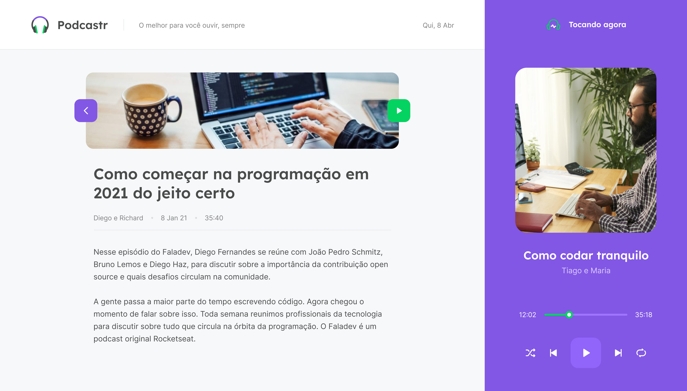

<h1 align="center">  

</h1>

<h2>  
:page_facing_up: Descrição 
</h2>
  

 O Podcastr é um app para ouvir podcasts sobre programação 

<h2>🛠 Tecnologias </h2>

Este projeto foi desenvolvido com as seguintes tecnologias

<ul>
<li>Next.js</li>
<li>React.js</li>
<li>TypeScript</li>
<li>Sass</li>
</ul>
  

<h2> Funcionalidades </h2>
<ul>
<li>Tocar podcast.</li>
<li>Quando um podcast acaba, outro começa em seguida.</li>
<li>Selecionar apenas um podcast para ouvir.</li>
<li>Opção de ir para o próximo podcast.</li>
<li>Opção de ir para o anterior podcast.</li>
<li>Opção de Loop.</li>
<li>Opção para embaralhar.</li>
</ul> 
